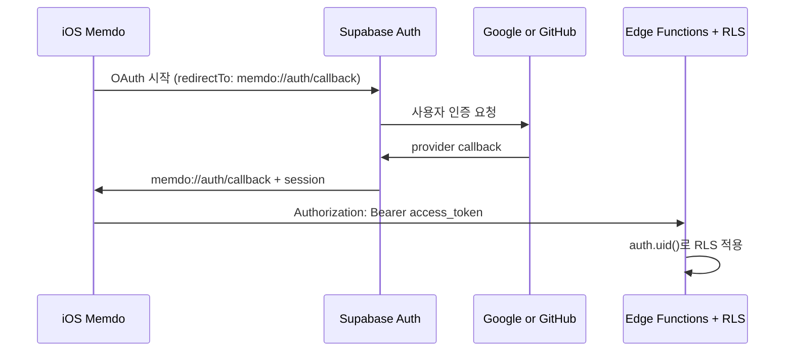

# Google·GitHub 소셜 로그인

## 결정

Memdo는 별도 로그인 서버를 만들지 않고 Supabase Auth OAuth를 사용한다. 앱은 Google 또는 GitHub
로그인을 시작하고, 성공하면 Supabase 사용자 session을 받는다. 이후 access token을 Edge Function에
전달하면 기존 RLS가 `auth.uid()` 기준으로 사용자 데이터를 분리한다.



## 구현된 위치

- `supabase/config.toml`: Google·GitHub provider 활성화, local callback, iOS redirect allow-list.
- `.env.example`: client ID와 secret의 이름만 정의. 실제 값은 커밋하지 않는다.
- DB migration의 `auth_user_created_initialize_memdo` trigger: 첫 로그인으로 생성된 Auth 사용자에게
  `개인`, `업무` 캘린더를 한 번만 생성한다.

## 로컬 provider 설정

먼저 `.env.example`을 복사해 `.env`를 만들고 아래 네 값을 채운다.

```dotenv
SUPABASE_AUTH_EXTERNAL_GOOGLE_CLIENT_ID=
SUPABASE_AUTH_EXTERNAL_GOOGLE_SECRET=
SUPABASE_AUTH_EXTERNAL_GITHUB_CLIENT_ID=
SUPABASE_AUTH_EXTERNAL_GITHUB_SECRET=
```

Google Cloud에서는 OAuth client 유형을 `Web application`으로 만들고 authorized redirect URI에
`http://127.0.0.1:54321/auth/v1/callback`을 등록한다. scope는 로그인에 필요한 `openid`, `email`,
`profile`만 사용한다.

GitHub에서는 OAuth App을 만들고 authorization callback URL에
`http://localhost:54321/auth/v1/callback`을 등록한다. 과거에 공유한 GitHub Personal Access Token은
OAuth client secret이 아니므로 여기에 사용하지 않는다.

값을 넣은 뒤 Docker 호환 runtime을 실행하고 다음 순서로 확인한다.

```bash
npm install
npm run start
npm run db:reset
npm run functions:serve
```

## 원격 Supabase 설정

원격 프로젝트를 만든 뒤 provider 양쪽에 공통으로 등록할 callback은 다음과 같다.

```text
https://<SUPABASE_PROJECT_REF>.supabase.co/auth/v1/callback
```

Supabase Dashboard에서 Authentication → URL Configuration에 `memdo://auth/callback`을 추가하고,
Authentication → Providers에서 Google과 GitHub client ID 및 secret을 입력한다. secret은 저장소, iOS
앱, 로그에 넣지 않는다.

## iOS 연결 계약

- callback scheme: `memdo`
- callback URL: `memdo://auth/callback`
- provider: `.google` 또는 `.github`
- 브라우저: `ASWebAuthenticationSession`
- session 저장: Supabase Swift Auth가 관리하는 session 저장소
- API 인증: access token을 `Authorization: Bearer <token>`으로 전달
- 로그아웃: Supabase Auth sign-out 후 앱의 사용자별 cache 제거

실제 앱 저장소는 하나의 Supabase client를 앱 루트 세션과 일정 repository가 공유한다. 로그인 화면은
Google·GitHub OAuth와 Debug 전용 익명 체험을 제공하고, 설정 화면에서 로그아웃한다. OAuth callback은
`memdo://auth/callback` 한 곳에서 처리하며 백엔드 저장소에는 iOS 코드를 복제하지 않는다.

## 동의와 scope 경계

로그인과 외부 서비스 연동은 분리한다. Google 로그인 시 Google Calendar 권한을 함께 요구하지 않고,
사용자가 캘린더 연동을 직접 선택한 시점에 별도 목적·scope·철회 방법을 보여준다. GitHub도 로그인에
repository 권한을 요청하지 않는다. provider token이나 refresh token을 일정 테이블에 저장하지 않는다.

## Sign in with Apple

Apple App Review 4.8 요구사항에 따라 Google·GitHub와 동등한 위치에 Sign in with Apple을 추가했다
(`MemdoApp.swift`, Supabase Auth의 Apple provider 연결). 로그인 화면은 Apple·Google·GitHub 세
provider로 제한하고 새 익명 세션 진입은 제공하지 않는다([ADR-071](../../memdo/docs/10-decisions-and-open-questions.md)).

## 완료 조건과 확인 상태

- Apple·Google·GitHub에서 각각 신규 가입·재로그인·로그아웃 성공. — 익명 세션 경로는 실제 계정으로
  검증됨(work-log 2026-08-03). 세 provider 모두 client ID/secret은 `.env.local`에 채워져 있고
  로그인 화면·callback 코드는 구현돼 있으나, 이 값으로 세 provider 각각의 실제 로그인 왕복을
  마지막으로 재확인한 기록은 없다 — 재개 시 가장 먼저 확인할 항목이다.
- callback 취소와 provider 오류가 앱에서 안전하게 복구됨. — 코드 경로 존재, 실기기 재확인 필요.
- 첫 가입 시 기본 캘린더가 정확히 한 번 생성됨. — 검증됨(work-log 2026-08-03, trigger 기반).
- 다른 사용자의 calendar와 todo 조회가 RLS로 거부됨. — 검증됨(보안 advisor, RLS 정책).
- 앱 재실행 후 session 복원 및 만료 token refresh 성공. — 익명 세션으로 검증됨(work-log 2026-08-03).
- 계정 삭제 시 Auth 사용자와 소유 데이터 삭제 경로가 검증됨. — 미검증. 출시 전 반드시 확인한다.
